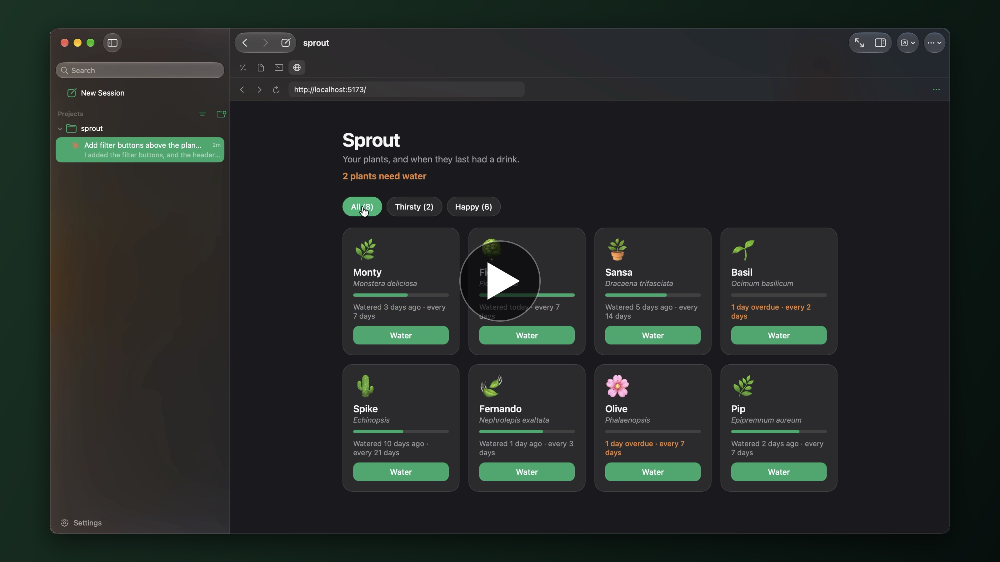

# Eden

A native macOS workbench for coding agents, by PhantasyCo. Pick a model, describe a change, and Eden runs the agent in your project, or in a git worktree of its own, so several can work side by side. All Swift, no Electron.

[](https://x.com/qqfantaize/status/2102794000386457746)

The one-minute demo (sound on): Opus 5.5 adds filters to a small web app, then the diff, the terminal, and the browser, all without leaving Eden. Opus 5.5 also drove Eden for the recording, filmed the takes, and edited them.

- **Five agents, one app:** Claude Code, Codex, Cursor, Grok, and OpenCode, through their official CLIs and your own sign-ins.
- **Built for the Mac:** SwiftUI and Liquid Glass, following Apple's design guidelines.
- **Review before you commit:** a Changes tab with the diff, plus Files, a terminal, and a browser in the side panel.
- **Stay in control:** approve tools as they come up, steer a running turn, and edit, regenerate, or branch any reply.

## Requirements

- macOS 26 or later, Xcode 26 (Swift 6.2)
- At least one agent installed and signed in: `claude`, `codex`, `cursor-agent`, `grok`, or `opencode`

## Build

```sh
swift script/bundle.swift --install   # build and install /Applications/Eden.app
swift script/bundle.swift             # or build/Eden.app as "Eden Dev", to try changes
```

## Docs

- [Using Eden](docs/USING.md)
- [Architecture](docs/ARCHITECTURE.md)
- [Development](docs/DEVELOPMENT.md) and [Testing](docs/TESTING.md)
- [Third-party notices](docs/THIRD_PARTY_NOTICES.md)

## License

GPL-3.0. See [LICENSE](LICENSE).
